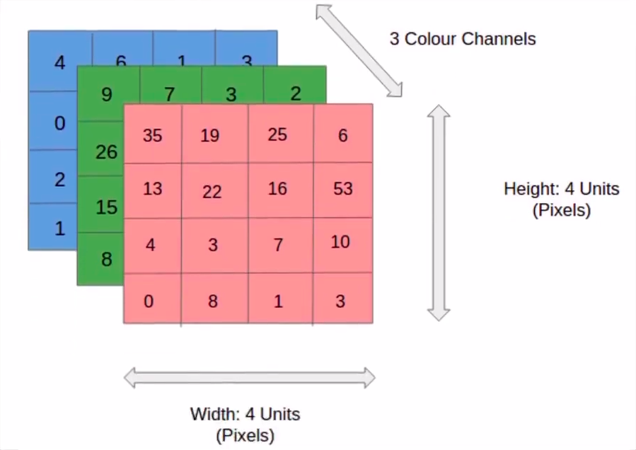
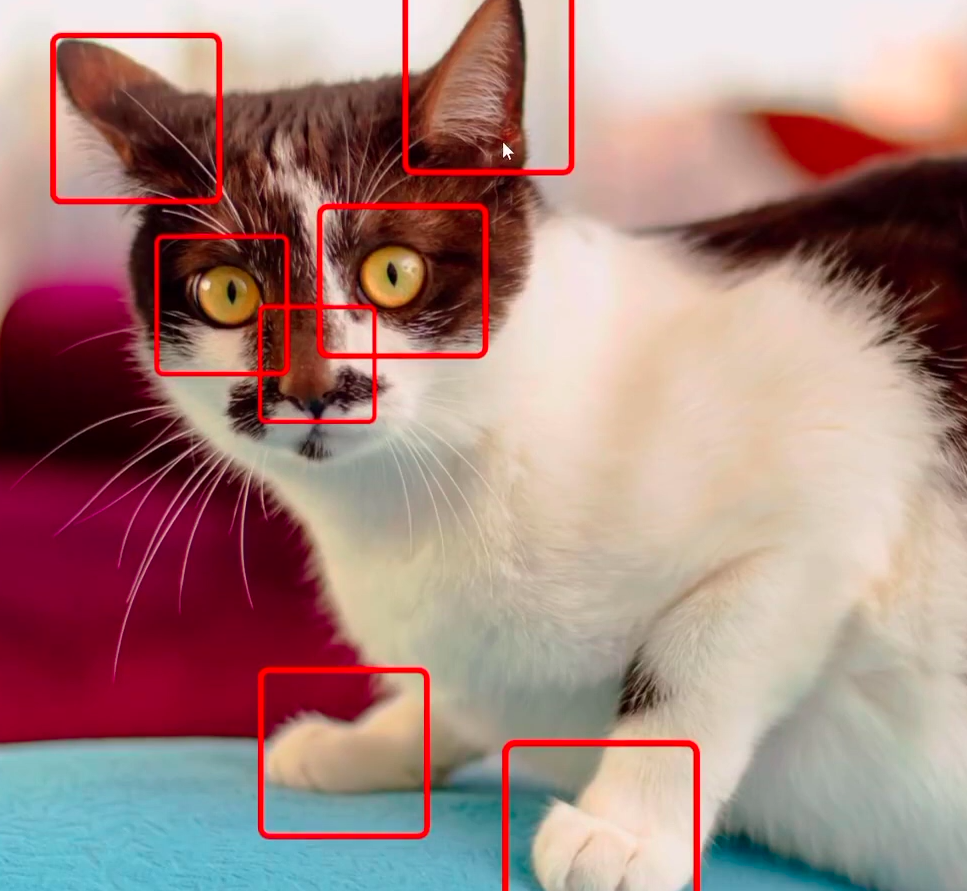
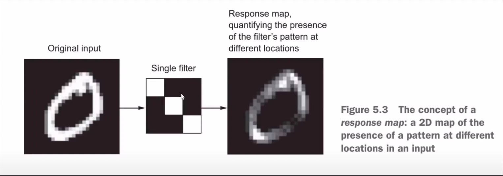
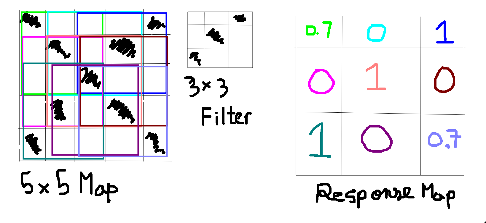
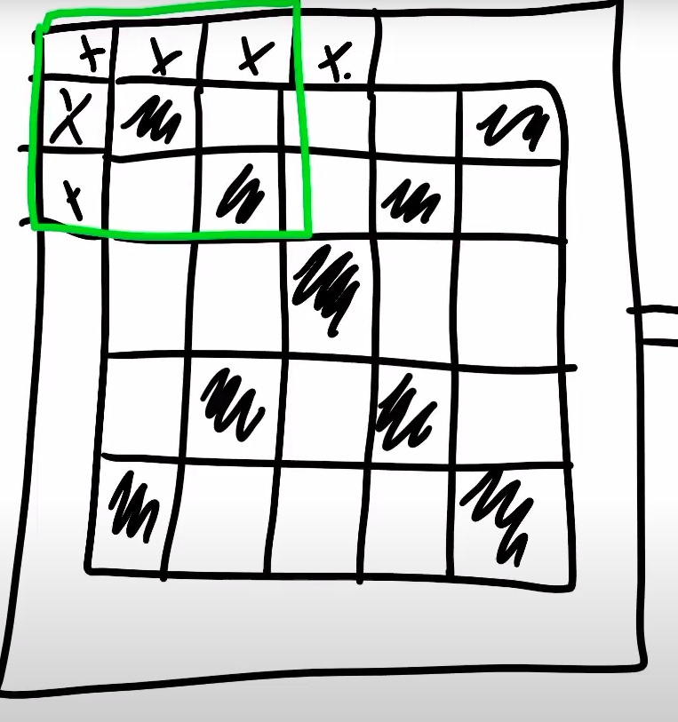
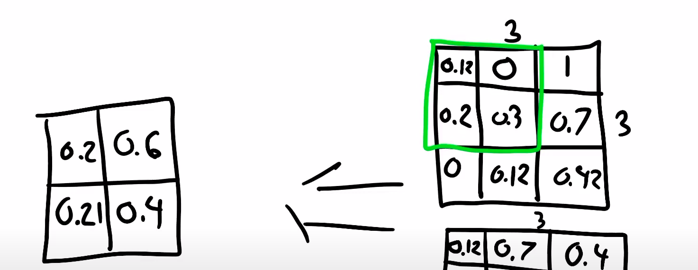

# Basics on Image data

There are essentially 3 dimensions in computer images

1. Image Width
2. Image Height
3. Color Channels

The three layers comprise the color channels dimension (red blue and green)

Each box is a pixel

# Convulational Neural Network 

While working with dense neural networks in DenseNeuralNetwork.py we looked for patterns in specefic areas of the image (pixel by pixel)
So it wouldn't work if the image was flipped vertically

For example the dense neural network will find these patterns in the picture and while evaluating will check if these features are present in the same location
But convulational neural network would remember that these patterns exist and while evaluating will search the entire image for this pattern

Dense neural layer outputs a number of numeric of values
Convulational neural layer outputs a feature map

Now filters are applied to imaged to figure out patterns for example  :

 

It applies the filter to each and every part of the picture and it reveals a feature map. 
This is done using several filters

For each Couvulational layer there will be three properties
* Image size
* No. of filters
* Sample size of filters

Notice here that the output feeature map is 3x3 while the orignal image is 5x5 so sometimes padding is added around the orignal image to get an output feature map of same dimensions as the orignal image

Pooling is used to reduce the dimensionality along with the complexity of the output feature map
There are basically 3 types:

* min
* max
* avg

Here avg pooling is shown

# Working with small datasets 

While working with small datasets we might not be able to achieve a very high accuracy so there are some techniques used to improve its accuracy

* Data Augentation : In terms of images, a single image can be rotated flipped or zoomed to create multiple images for the datasets, improving accuracy

* Pretrained Models : There are several neural networks that are open source we can use for example google provides such services however they require fine tuning to serve our specefic purposes

