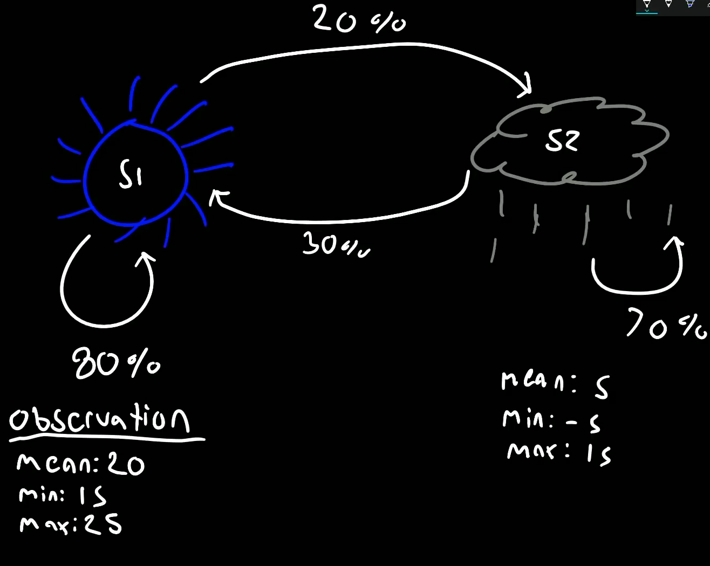

# Types of Data
There are 2 kinds of data:
    * Numerical
    * Categorical (non-numerical)

Categorical data doesnt make sense to the model training so it is replaced by numbers, 
for example in a train there is first class second class and general , They can be converted to 0,1,2

# Tensorflow Core Learning Algorithms

## Linear Regression
It involves finding the "line of best fit" (line equally closest to all data points)

So for specefic x you can predict a y using linear regression
It is used when data-points are linearly related

## Training Process

### Batches
To feed a huge amount of data to a model (like 25TB) you have to break them into smaller parts and then feed them.
Smaller parts are known as batches (usually a size of 32 is considered)

These batches are fed to the model multiple times depending on the number of epochs

### Epochs 
Number of epochs we define is the amount of times our model will see the entire dataset
Ex. If we have 10 epochs, our model will see the same dataset 10 times

### Input Function
To pass these datasets we will need an input function to actually input the data into the model

## Classification

It is seperating datapoints into different categories rather than predicting a value such as chance of survival

#### DNN Classifier is recommended over Linear classifier in tensorflow

## Clustering

Clustering is basically grouping of simmilar data

### K - Means Clustering

Let data points be plottable on a graph paper, then algorithm to make clusters is - 
1. Choose k points (on the graph), and assign them as centroids
2. Group each datapoint under one of these centroids 
3. Move the centroid to the center of these groups and regroup all the data points
4. Repeat till all the data points do not change their groups
5. Then you would have got k clusters

## Hidden Markov Models
The Hidden Markov Model is a finite set of states, each of which is associated with a generally multidimensional probability distribution
Transitions among states are governed by a set of probablilities known as transition probabilities

It works with probabilities to predict future events or states.

Elements of Markov Model:

States : Each model has a finite amount of states. Some examples of states in a weather model are sunny and cloudy (2 states here)
            These are hidden, we do not directly observe them

Observations : Each state has a particular outcome or observation based on probability distribution.For example,  If it's a sunny day there
                is a 20% chance of catching a cold, while if it's a cloudy day there is a 70% chance of catching a 
                
Transitions : Each state has a probability of changing to a different state. For example on a sunny day, the chance of having a cloudy day
                the next day is 30% while if its a cloudy day there is a 40% chance next day will be a sunny day

